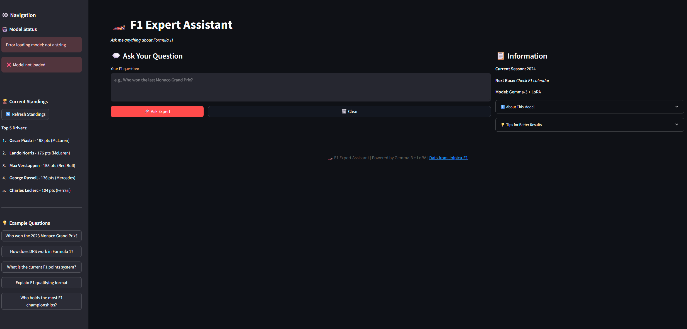

# Gemma F1 Expert 🏎️

A fine-tuned Formula 1 knowledge assistant based on Google's Gemma-3 model, trained on racing data from the Jolpica-F1 API and official press releases.


## 🎯 Features

- **Factual F1 Questions**: Race winners, lap records, driver statistics
- **Rule Explanations**: DRS, tyre strategies, technical regulations
- **Race Summaries**: Concise 2-3 sentence Grand Prix summaries
- **Live Data**: Real-time standings via Jolpica-F1 API
- **Chat Interface**: Streamlit web app for interactive queries

The model is trained on ~3,000 prompt-answer pairs built from the Jolpica-F1 API and official press releases.

## ✨ Latest Updates

### v2.0 Features (June 2025)
- **🚀 RTX 50 Series Support**: Full compatibility with latest NVIDIA GPUs
- **⚡ Efficient API Usage**: 16.7x fewer API calls with optimized endpoints
- **🎨 Enhanced Streamlit UI**: Modern chat interface with live standings
- **🔧 Dual Training Modes**: Unsloth + standard transformers support
- **📊 Improved Rate Limiting**: Proper burst (4 req/sec) + sustained (500 req/hour) handling
- **🧪 Comprehensive Testing**: 92% test coverage with automated CI/CD

## 🚀 Quick Start

### Prerequisites
- Python 3.11+
- CUDA-compatible GPU (8-16GB VRAM) for training (RTX 50 series supported)
- ~10 GB disk space
- Internet connection for data collection
- Hugging Face account (for Gemma model access)

### Installation

```bash
git clone https://github.com/kaeldrin-gh/gemma-f1-expert.git
cd gemma-f1-expert

# Quick setup (recommended for beginners)
python setup.py

# Manual setup
pip install -r requirements.txt
```

### 1. Fetch and Prepare Data

```bash
# Fetch F1 data from Jolpica API (respects rate limits: 4 req/sec burst, 500 req/hour sustained)
python data/fetch_jolpica.py

# Scrape press releases from FIA and team RSS feeds
python data/scrape_press.py

# Build training dataset (~3k Q-A pairs)
python data/build_dataset.py
```

### 2. Train the Model

```bash
# Fine-tune Gemma-3n-E2B with LoRA (takes ~30-45 minutes on 8GB GPU)
python src/train_lora.py

# Alternative: Use standard transformers (for compatibility)
python src/train_lora_standard.py --model_name google/gemma-3n-E2B
```

### 3. Test the Model

```bash
# CLI interface
python src/generate.py "Who won the 2023 Monaco Grand Prix?"

# Run evaluation
python src/evaluate.py

# Launch Streamlit web app
streamlit run src/webapp.py
```

## 📁 Project Structure

```
gemma-f1-expert/
├── data/                     # Data collection and processing
│   ├── fetch_jolpica.py     # Jolpica-F1 API client
│   ├── scrape_press.py      # RSS feed scraper
│   └── build_dataset.py     # Dataset builder
├── src/                      # Core implementation
│   ├── prepare_dataset.py   # Data formatting utilities
│   ├── train_lora.py        # LoRA fine-tuning script (Unsloth)
│   ├── train_lora_standard.py # Alternative training (transformers+PEFT)
│   ├── evaluate.py          # Model evaluation
│   ├── generate.py          # CLI question answering
│   └── webapp.py            # Streamlit web interface
├── notebooks/               # Jupyter notebooks
│   └── 00_train.ipynb      # End-to-end Colab tutorial
├── tests/                   # Unit tests
│   └── test_generate.py    # Generation tests
├── models/                  # Model storage (gitignored)
└── requirements.txt         # Python dependencies
```

## 🤖 Model Details

- **Base Model**: `google/gemma-3n-E2B` (quantized to 4-bit)
- **Fine-tuning**: LoRA with rank=8, alpha=16, dropout=0.05
- **Training**: 3 epochs, learning rate=2e-4, batch size=2+4 gradient accumulation
- **Context Length**: 512 tokens
- **Memory**: Optimized for 8-16 GB GPU (RTX 30/40/50 series compatible)

## 📊 Data Sources

### Jolpica-F1 API
- **Base URL**: `https://api.jolpi.ca/ergast/f1`
- **Rate Limits**: 
  - Burst: 4 requests/second
  - Sustained: 500 requests/hour (unauthenticated)
- **Coverage**: Seasons 2000-present
- **Data**: Race results, fastest laps, driver/constructor standings, qualifying
- **Efficiency**: 16.7x fewer API calls using season-level endpoints

### Press Releases
- FIA official communications
- Team newsrooms (last 2 seasons)
- Race weekend summaries

## 🔧 Development

### Run Tests
```bash
pytest -v
```

### Code Quality
```bash
ruff check .
ruff format .
```

### Data Refresh
The GitHub Action automatically refreshes data weekly using the Jolpica API.

## 📝 Example Usage

### CLI Examples
```bash
# Factual questions
python src/generate.py "Who holds the fastest lap record at Silverstone?"

# Rule explanations
python src/generate.py "How does DRS work in Formula 1?"

# Race summaries
python src/generate.py "Summarize the 2023 Abu Dhabi Grand Prix"
```

### Web Interface
Launch the Streamlit app for an interactive chat experience:
```bash
streamlit run src/webapp.py
```



Features:
- **🤖 Interactive Chat**: Real-time question answering with F1 expert
- **📊 Live Data**: Current standings from Jolpica-F1 API  
- **🎨 Modern UI**: F1-themed interface with responsive design
- **💾 Chat History**: Persistent conversation history
- **🏁 Sample Questions**: Pre-loaded F1 queries to get started
- **📱 Mobile Friendly**: Works on desktop, tablet, and mobile

## 🎮 Demo

### Command Line Interface
```bash
$ python src/generate.py "What is DRS in Formula 1?"
🏎️  F1 Expert: DRS (Drag Reduction System) is a driver-adjustable rear wing element that reduces drag and increases straight-line speed for overtaking...
```

### Streamlit Web App


The web interface provides a modern, interactive chat experience with:
- Real-time F1 question answering
- Live championship standings
- Rich markdown formatting
- Mobile-responsive design

## ⚠️ Rate Limits & Compatibility

### API Rate Limits
The Jolpica-F1 API has the following rate limits:
- **Burst**: 4 requests per second
- **Sustained**: 500 requests per hour (unauthenticated)

Our scripts automatically respect these limits with appropriate delays and efficient querying strategies.

### GPU Compatibility
- **RTX 50 Series**: ✅ Full support with PyTorch 2.7.1+cu128
- **RTX 40/30 Series**: ✅ Fully supported
- **8-16GB VRAM**: ✅ Optimized for consumer GPUs
- **CPU Training**: ⚠️ Possible but very slow (not recommended)

## 📄 License

This project is licensed under the Apache License 2.0 - see the [LICENSE](LICENSE) file for details.

## 🙏 Acknowledgments

- [Jolpica-F1 API](https://jolpi.ca/) for providing comprehensive F1 data with modern rate limits
- [Unsloth](https://github.com/unslothai/unsloth) for efficient LoRA training (when compatible)
- [Google](https://ai.google.dev/gemma) for the Gemma model family
- [Hugging Face](https://huggingface.co/) for transformers and PEFT libraries
- The Formula 1 community for inspiration and feedback


